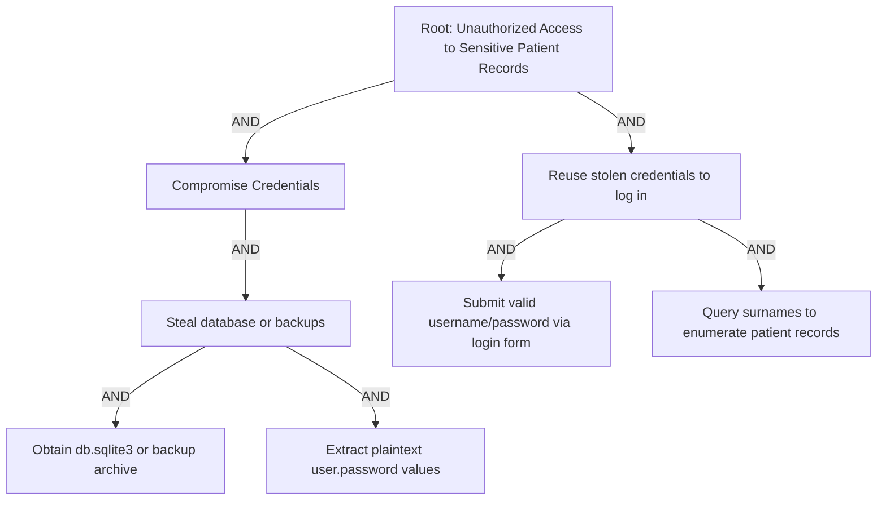

# Attack Tree: Unauthorized Access via Plaintext Passwords

**说明**
- **AND** 边表示必须同时满足的步骤；**OR** 边表示可任选其一（这里只展开了“窃取数据库→明文密码”路径，保留其它可能分支以示完整性）。
- 节点 `S2` 体现了漏洞本身：数据库直接保存明文密码，攻击者只需离线执行一条 `sqlite3` 查询即可获得所有凭证。
- 节点 `C2` 展示利用阶段：有了合法凭证即可通过登录表单访问医生名下的全部患者，再逐个姓氏枚举实现“未授权访问”。

