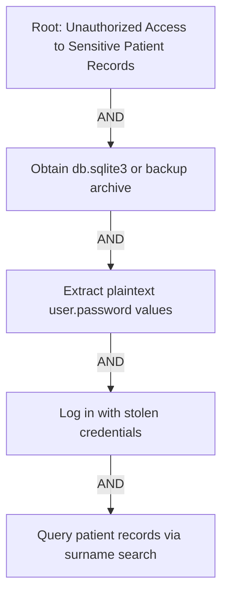

# Attack Tree: Unauthorized Access via Plaintext Passwords

```mermaid
graph TD
  R["Root: Unauthorized Access to Sensitive Patient Records"]
  R -->|"AND"| S1["Obtain db.sqlite3 or backup archive"]
  S1 -->|"AND"| S2["Extract plaintext user.password values"]
  S2 -->|"AND"| S3["Log in with stolen credentials"]
  S3 -->|"AND"| S4["Query patient records via surname search"]
```

